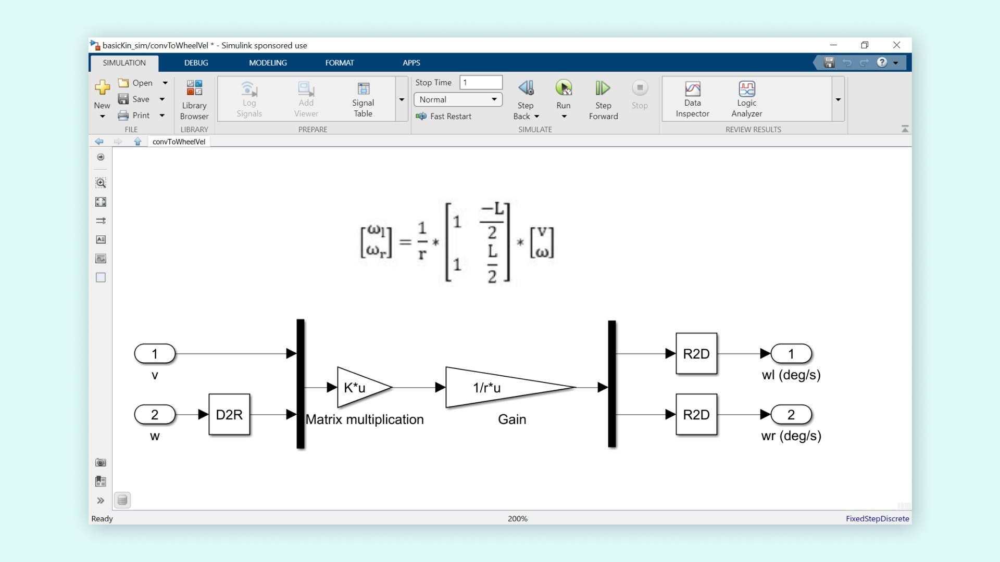
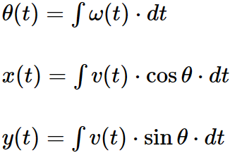

<h2 align="center">Demonstration video</h2>

## Contents:
<ol>
   <li><a href="https://s-nithish-kumar.github.io/WebCam_Controlled_Rover/#1-objectives">Objectives</a></li>
   <li><a href="https://s-nithish-kumar.github.io/WebCam_Controlled_Rover/#2-sensors">Sensors</a></li>
   <li><a href="https://s-nithish-kumar.github.io/WebCam_Controlled_Rover/#3-actuators">Actuators</a></li>
   <li><a href="https://s-nithish-kumar.github.io/WebCam_Controlled_Rover/#4-controlling-the-rover-and-forklift-using-simulink-rover-control">Controlling the Rover and forklift using Simulink Rover Control</a></li>
   <li><a href="https://s-nithish-kumar.github.io/WebCam_Controlled_Rover/#5-kinematics-of-the-rover">Kinematics of the Rover</a></li>
   <li><a href="https://s-nithish-kumar.github.io/WebCam_Controlled_Rover/#6-simulating-rover-kinematics-and-open-loop-control">Simulating Rover Kinematics and Open Loop Control</a></li>
   <li><a href="https://s-nithish-kumar.github.io/WebCam_Controlled_Rover/#7-open-loop-control-of-the-rover-position">Open loop control of the Rover position</a></li>
   <li><a href="https://s-nithish-kumar.github.io/WebCam_Controlled_Rover/#8-closed-loop-control-of-the-rover-position">Closed loop control of the Rover position</a></li>
   <li><a href="https://s-nithish-kumar.github.io/WebCam_Controlled_Rover/#9-program-rover-to-follow-path-instructions">Program Rover to follow Path Instructions</a></li>
   <li><a href="https://s-nithish-kumar.github.io/WebCam_Controlled_Rover/#10-localization-to-calculate-rover-position">Localization to Calculate Rover Position</a></li>
   <li><a href="https://s-nithish-kumar.github.io/WebCam_Controlled_Rover/#11-navigate-the-arena-and-move-the-target">Navigate the Arena and Move the Target</a></li>
   <li><a href="https://s-nithish-kumar.github.io/WebCam_Controlled_Rover/#12-problems-and-troubleshooting">Problems and troubleshooting</a></li>
   <li><a href="https://s-nithish-kumar.github.io/WebCam_Controlled_Rover/#13-results-and-conclusion">Results and Conclusion</a></li>
</ol>

### 1. Objectives:
- Program the Rover to perform a variety of tasks, such as following paths and moving objects with the forklift.
- Understand how differential drive robots work and simulate their behavior.
- Control the position or speed of the robot and perform its localization.

### 2. Sensors:
- Rotary encoder, mounted on the rear wheel motors, to measure the distance traveled, velocity, and angular velocity of the robot.
- Battery voltage sensor to measure the battery voltage level and turn the controller off before running out of charge.

### 3. Actuators:
- Geared DC motors to drive the wheels.
- Servo motor for the forklift.

### 4. Controlling the Rover and forklift using Simulink Rover Control:
- Mechatronic devices have a lot of sensor and motor connections. It's important to ensure that the sensors are properly connected and the motor terminals are in the desired polarity.
- The SIMULINK Rover Control program, which looks like an user interface shown in Figure , is used to control and verify the proper working of DC motors, Servo motors, encoders, and battery voltage.

Figure 1 Hardware Test Model

- The program is run in External mode to allow communication between the PC and the hardware.
- MATLAB code can also be used to control the DC motors and the Servo motor.

### 5. Kinematics of the Rover:
- The following diagram shows the basic kinematics of the Rover (or any differential drive robot).

Figure 2 Kinematics of the Rover

- The diagram introduces a few important parameters associated with differential drive robots, including radius of rotation (R), rate of rotation (ω), instantaneous center of curvature (ICC), wheel velocities (vl, vr), distance between the wheels (L), and the forward velocity (v).
- After a few mathematical derivations, the following matrix is derived, which gives the angular velocities of the wheels required to drive the rover based on the linear velocity (v) and rate of rotation (ω). For our Rover, L = 8.5 cm and r = 4.5 cm.

### 6. Simulating Rover Kinematics and Open Loop Control:
- The kinematic equations derived for the differential drive robot are implemented in Simulink, as shown below in the Figure.

Figure 3 Implementation of differential drive robot in Simulink

- Signal builder blocks can be used for providing linear velocity (v) and rate of rotation (ω) to the ConvToWheelVel subsystem, which has the rover kinematics.
- The output of the ConvToWheelVel subsystem, i.e., wl and wr, is fed into the Rover Simulation subsystem, as shown below, for simulating the rover's movement.

Figure 4 Kinematic Equation Simulation

- The location (x, y) and the heading (θ) of the Rover in an X-Y coordinate system can be described using the following equations:

Figure 5 Rover location and heading equation

- The Rover Simulation subsystem has three subsystems: Encoder Simulation, Vehicle Kinematics, and a robot path plotter.

Figure 5 Rover Simulation Subsystem

- The Encoder simulation subsystem converts the desired wheel rotational speeds from deg/s to degrees rotated by the wheel to mimic the encoder on the Rover.
- The Vehicle kinematics subsystem implements the equations for θ(t), x(t )and y(t). The output of this subsystem is the orientation of the rover (θ),  and x, y coordinates.
- The Robot path planner subsystem has the plotRobot MATLAB function. This is used to draw the robot's trajectory.
- Opening the plotRobot MATLAB Function block shows the robot's position.

Figure 6 Map of the Robot

### 7. Open Loop Control of the Rover Position:
- The input signals and the convToWheelVel subsystem are the same as in the previous model, but the rotational speeds are sent directly to the actual motors that are presented as blocks inside the model.

Figure 7 Open Loop Control

- Inside the LeftMotor and RightMotor subsystems, the commanded rotational speeds are converted to PWM using new motor characterization data.

Figure 8 Motor Subsystem

### 8. Closed loop control of the Rover position:
- It's very difficult to accurately control the system using open-loop control unless there is a very accurate model of the motor behavior and operating environment. Here comes the need for closed loop control.
- A PID controller is added for more accurate linear distance control.

Figure 9 Distance Closed Loop Control

- A PI controller is added for more accurate control over the angle.

Figure 10 Angle Closed Loop Control

### 9. Program Rover to follow Path Instructions:
- The model shown in Figure will execute a simulation of the movement of the rover. It has the convToWheelVel and Rover Simulation subsystems and the StateLogic chart. The outputs of the Rover simulation—distance, and angle are fed to the state logic in the model, creating a feedback loop. Adding a motor block after the convToWheelVel subsystem makes the program ready to be implemented in the physical rover.

Figure 11 State Logic Simulation

- The values (distance and angle) are fed into the Stateflow Chart represented by the StateLogic chart, which calculates the rover's velocity and rotation rate.
- The StateLogic chart is shown in Figure. The states are displayed sequentially and have a transition condition that is shown by an arrow at the exit of each box. These different events can be either temporal in nature (e.g., exit the block after a certain time) or boolean statements (e.g., comparing different variables against a constant).

Figure 12 State Logic

### 10. Localization to Calculate Rover Position:
- An arena of 500 x 500 mm is set up for the rover, and the USB camera is placed perpendicular to the arena at a height of 5 feet.
- The localization algorithm needs calibration, which is done by following five steps, which are explained in the video.
- Once calibrated, the rover and the target can be placed in the arena to find their positions.

### 11. Navigate the Arena and Move the Target:
- In the previous section, a webcam was used with a localization algorithm to get the initial locations of the rover and target in the arena.
- The Waypoints block feeds the Stateflow chart named planPathLogic, in addition to the distance and angle, to describe the state machine commanding the rover. The RoverSimulation subsystem has also been modified to take the waypoints as input. Figure shows the Plan path simulation program.

Figure 13 Plan Path Simulation

- This model uses the same convToWheelVel subsystem from previous sections to calculate wheel speeds based on rover velocity and rate of rotation.
- The RoverSimulation subsystem is like previous sections, except now it takes one additional input: a matrix providing the rover's starting location in the first row, the object's location in the second row, and the endpoint location in the third row (x, y). The subsystem uses this information to plot the waypoints in the animation it creates.
- These three locations are also used as input to the planPathLogic chart shown in Figure, which handles the path planning for the rover.
- The chart has four states corresponding to the operating modes of the rover: StopFirst, Turn, MoveForward, and Stop.
- When the simulation begins, the rover is in the StopFirst state. The rover is in this state for 1 second and does not move during this time.
- After the StopFirst state, the rover enters the Turn state. Here, it rotates the appropriate amount until it's facing the next waypoint. Then, the rover enters the MoveForward state, where it moves forward the appropriate distance to reach this waypoint. 
- The desDistance and desAngle MATLAB functions are used to calculate the distance and the angle between two waypoints.

Figure 14 Plan Path Logic

- Replacing the Rover simulation with the motor control block makes the model ready to be deployed on the hardware.
- The path following the Simulink model is combined with the forklift model, as seen in Figure, to follow the waypoints, pick, and place the object.
- The rover turns, moves forward a little, drops the forklift, moves forward, picks up the object, makes a turn, moves forward, and drops the object.

Figure 15 Rover path plan and forklift

### 12. Problems and troubleshooting:
- The localization algorithm was not accurate enough, and most of the time it was not able to locate the rover and the target. Proper lighting setup is required for the algorithm to detect the rover and the target positions.
- Even with proper lighting conditions, due to the reflection of light on the marker on top of the robot, the algorithm was not able to localize the rover. Lights have to be placed in the correct location to avoid reflections.
- Though the simulink model was correct, the rover didn’t behave as expected. This was because of the loose connection in the motor encoder, which provided incorrect output and made the rover misbehave. Even Though all the sensors were tested in the beginning, the connection slackened eventually. So it’s always important to check the sensor connections before deploying the model.

### 13. Results and Conclusion:
- All the sensors and actuators are tested at the beginning to ensure proper functioning.
- The rover's kinematics are studied and modeled in Simulink to perform simulation and deployed in hardware.
- The rover is programmed to follow a set of waypoints, which are found using the localization algorithm.
- The path following model is combined with the forklift model to move the rover, lift the object, and place it at the destination.
+ With the appropriate lighting conditions and proper sensor connections, the rover is made to reach the object, pick it up, and place it in the desired location.

